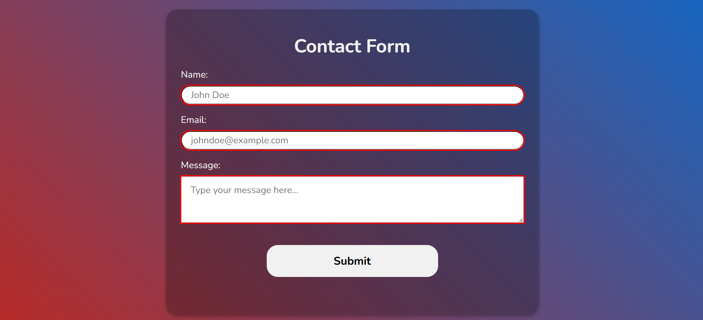

# 📁 Contact Form

## ℹ️ A Stylish and Functional Contact Form

This project demonstrates a clean and responsive contact form built using HTML5 and modern CSS. It includes built-in HTML validation and visual feedback for input states, ensuring both functionality and user-friendliness.

It was built entirely with HTML and CSS as part of the [**freeCodeCamp.org**](https://www.freecodecamp.org/learn/full-stack-developer/) CSS course.

---

## 🔍 Overview

This project consists of a contact form with three key input fields: name, email, and message. The form uses semantic HTML for accessibility and is styled using custom CSS variables for maintainability and visual appeal.

The design includes hover, focus, valid, and invalid visual states for inputs and a responsive layout that works across different screen sizes. The form submits data to [httpbin.org](https://httpbin.org/post) for testing form handling.

---

## ✨ Features

- Responsive design that adapts to various screen sizes
- Built-in HTML5 validation with visual feedback
- Styled form inputs and buttons with CSS variables
- Modern gradient background and shadow effects
- Focus and active state accessibility styling
- Semantic HTML structure

---

## 🧠 What I Learned

- How to use semantic HTML elements to structure forms
- Styling input states with `:valid`, `:invalid`, `:focus`
- Responsive sizing using `clamp()` and `max-width`
- Implementing form submission to external testing endpoints (e.g., `httpbin.org`)
- Creating a visually appealing layout using gradients and shadows

---

## 🛠️ Tech Used

- HTML5
- CSS3

---

## 🚀 How to Run

1. Clone the repository
2. Navigate to this project folder
3. Open `index.html` in your browser

---

## 🌐 Live Demo

Or you can check out the 👉 [live website here](https://html-css-daily.netlify.app/design%20a%20contact%20form/)

---

## 🧑‍💻 Author

Created by **Elmar Chavez**

🗓️ Month/Year: **May 2025**

📚 Journey: **2nd** month of learning _frontend web development_.
